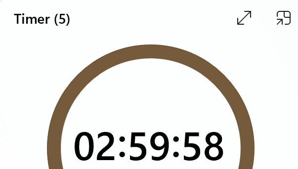
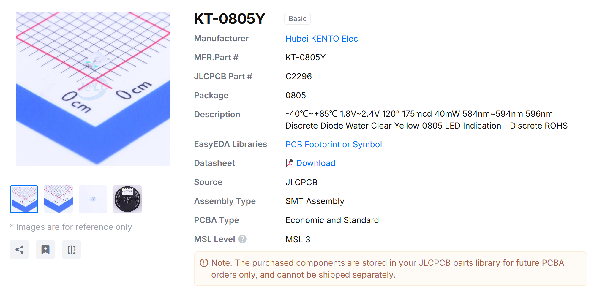
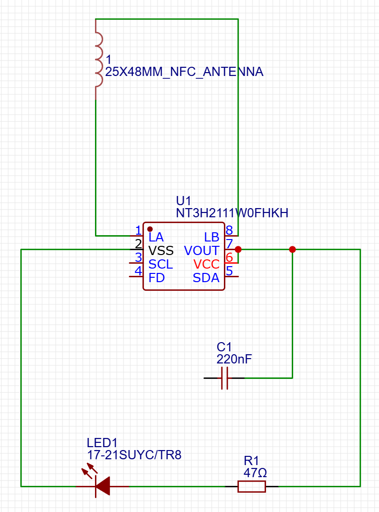
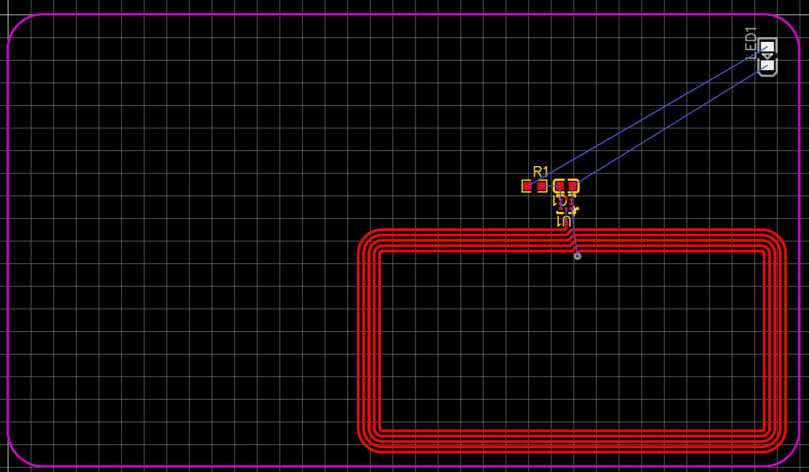
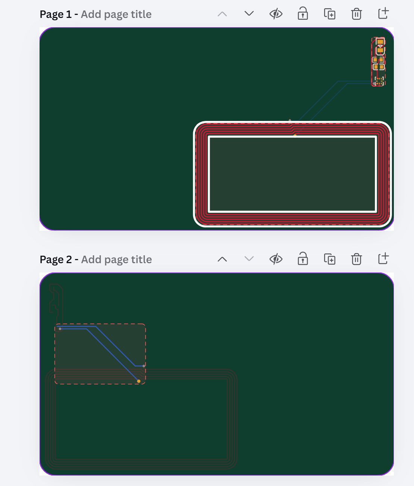
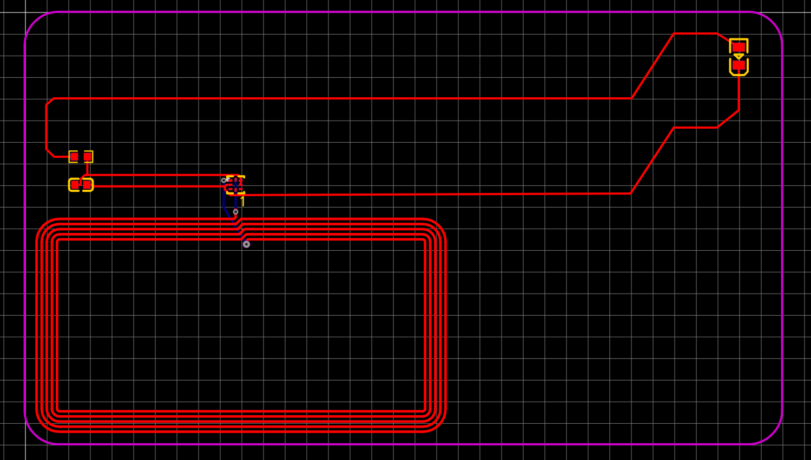
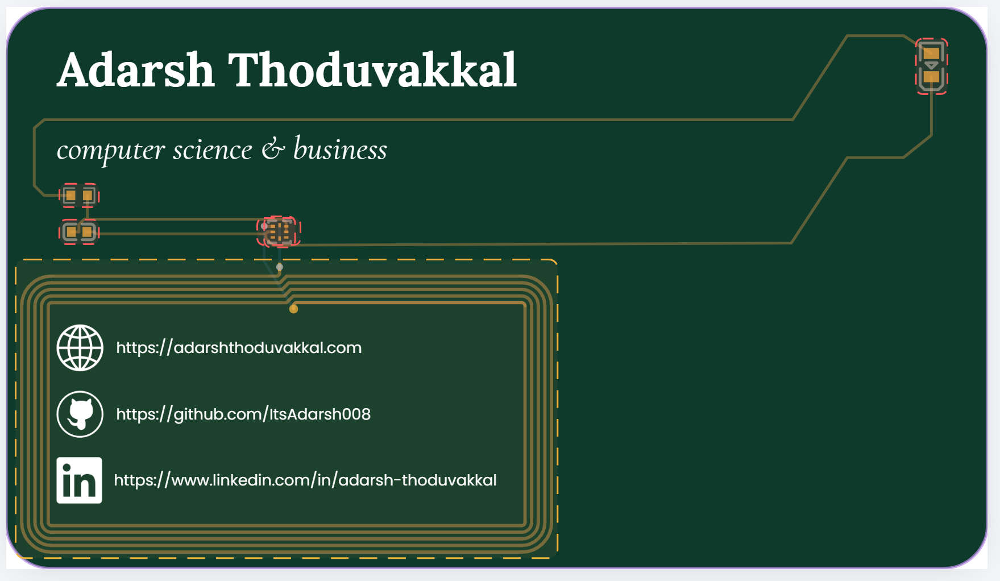
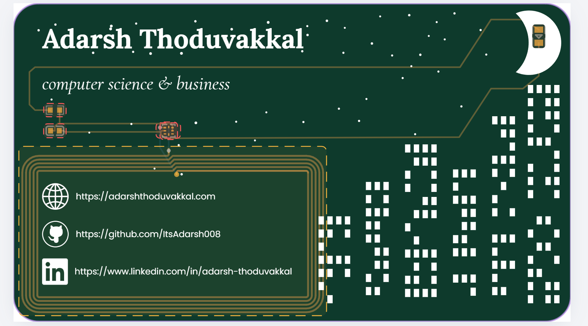
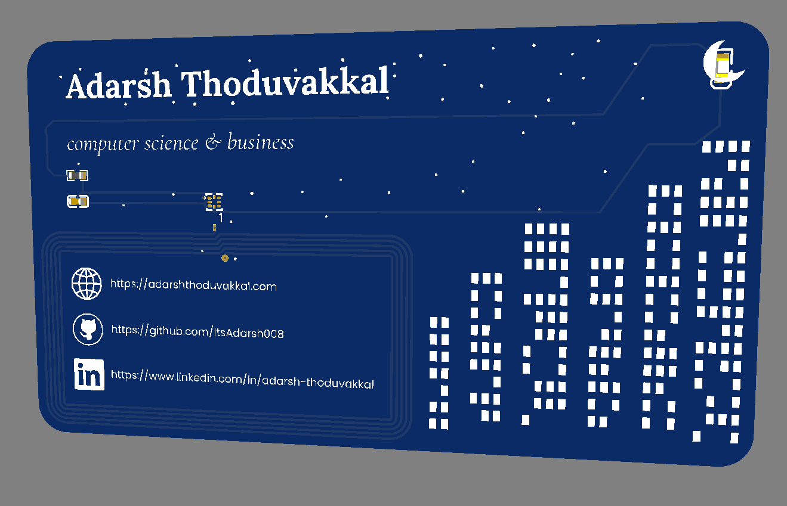

# July 29, 5:09 PM: Starting out with To-DO List

My goal for this project is to complete it in one day (specifically, 3 hours). It's currently 5:09 PM, and by 5:30 I want to have all my tabs opened, so I'm ready to learn all the tools I'll need to actually create the card. I also want to set up a quick to-do list at the top of this journal, which I'll do now. ~~The journal will use each task as a header.~~ *Turns out that each header reads as a different day in the website. Changed!* (There will also be timestamps as each is completed, if the task is big enough to have an image associated with it.)

---
TO DO LIST: Hardware

- [x] Set up journal, project, Have all the necessary tabs open (starting with the tutorial)
- [x] Learn how to use EasyEDA (from the hacker card tutorial)
- [x] Have all the PCB functionality laid out, with all the wires connected with the NFC
- [x] Look into adding extra functionality that's not in the tutorial (maybe an extra NFC reader? I'm not sure. Maybe more LEDS?)

Art/Text

- [x] Figure out what I want to actually put on the Card using Figma or Canva or something
- [x] Translate that onto EASYEDA (not sure how, so I'll have to figure out how to do this)
- [ ] Project Complete

---

# July 29, 5:25 PM: Getting the PCB Functionality Laid Out (Hardware)

- [x] Set up journal, project, Have all the necessary tabs open (starting with the tutorial)
- [x] Learn how to use EasyEDA (from the hacker card tutorial)
- [x] Have all the PCB functionality laid out, with all the wires connected with the NFC
- [x] Look into adding extra functionality that's not in the tutorial (maybe an extra NFC reader? I'm not sure. Maybe more LEDS?)

The above items were completed as a batch in this entry.

**5:27 PM**

The tutorial has a yellow LED set up, but I want to find a white LED. Going to see if I can match the same electrical specifications but for a different colour.

**5:39 PM**

Did some research, and it turns out that white will never work due to the voltage. Furthermore, my backup (blue), will also never work due to the voltage.

**bruh**

Oh well, time to go back to the yellow.

**5:52 PM: Wiring Completed**

Pretty weird trying to get the red circles (connectors between wires) but that just shows my hardware knowledge after a 1 year hiatus :skull:

**6:13 PM: Wiring Completed**

Here's how I have my wiring set up. I want to have the physical raised portion of the NFC antenna serve as a box for some of my links. As I say this, I'm realizing I probably need to buy a domain for my website before actually having this card rendered.

**6:38 PM: 3D routing complete**

Wow was this more effort then I expected it to be. I cannot comprehend how crazy the art will be after this.

Decided not to add any extra functionality due to power restrictions with NFC.

**Total time spent: 1 hour**

# July 29, 6:54 PM: Starting on the Artwork Portion (took a 20 minute break)

- [x] Figure out what I want to actually put on the Card using Figma or Canva or something
- [x] Translate that onto EASYEDA (not sure how, so I'll have to figure out how to do this)
- [ ] Project Complete

**7:11 PM: Importing dimensions into Canva**

Used a converter to turn the JSON file into dimensions, and added them into this canva file.

**8:34 PM: Updated tracing to fix for right-handed user**

Took a bit of a break and came back to realize that since I'm right handed, the information and NFC reader would need to be on the left side for this to work properly. Fix completed.

**9:03 PM: Added text portions**

Added all the information I needed. Used the silkscreen and existing components as guidelines, with a trace being used to underline my name.

**Total time spent: 2 hours**

**9:38 PM: Preliminary design completed**

I've landed on this design, but it's still not perfect. the windows are a bit too sparse, the buildings don't come together well. furthermore, I don't want them to infringe on the NFC antenna.

**10:10 PM: Front Artwork Complete**

After a horrific amoutn of fiddling with x and y offsets and canva (scale was completely off, wahoo!)...

