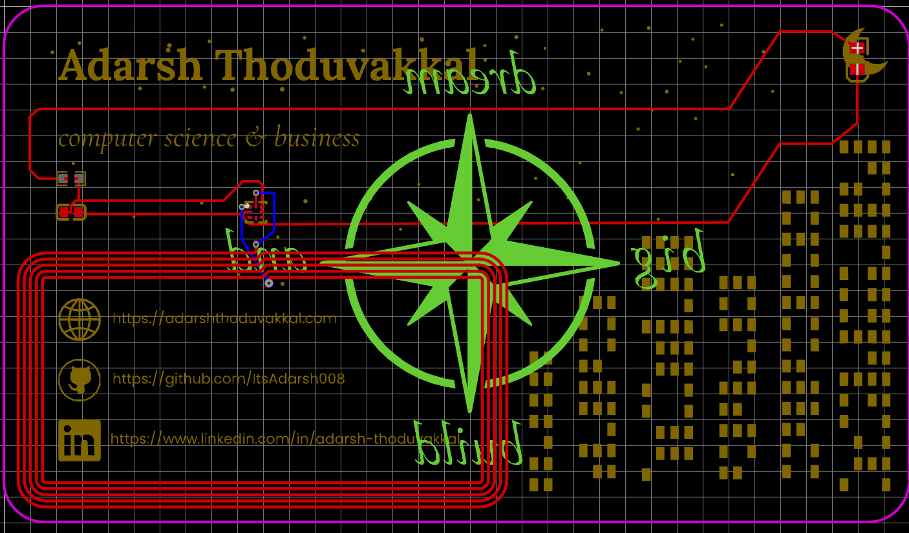
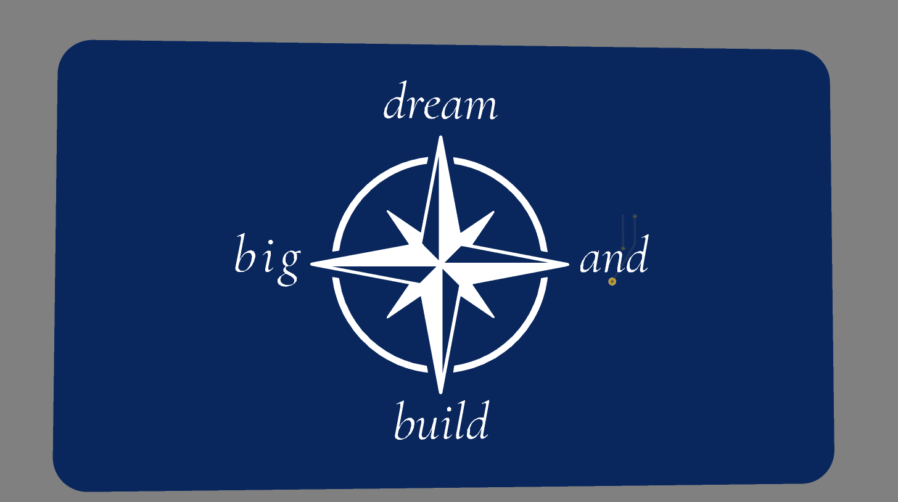

# PCB-usiness Card
## Project made for Hack Club's Forge Hardware YSWS

This is a NFC business card designed with EasyEDA and Canva.

### PCB

### Schematic / Wiring Diagram

### 3D Model Rendered

Bill of Materials:

| ID | Name | Designator | Footprint | Quantity | Manufacturer Part | Manufacturer | Supplier | Supplier Part | Price |
| --- | --- | --- | --- | --- | --- | --- | --- | --- | --- |
| 1 | 25X48MM_NFC_ANTENNA | 1 | 25X48MM_NFC_ANTENNA | 1 | — | — | — | — | — |
| 2 | 220nF | C1 | C0603 | 1 | CL10B224KA8NNNC | SAMSUNG(三星) | LCSC | [C21120](https://www.lcsc.com/product-detail/C21120.html) | 0.02 |
| 3 | 17-21SUYC/TR8 | LED1 | LED0805-R-RD | 1 | KT-0805黄灯 | KENTO | LCSC | [C2296](https://www.lcsc.com/product-detail/C2296.html) | 0.012 |
| 4 | 47Ω | R1 | R0603 | 1 | 0603WAF470JT5E | UNI-ROYAL(厚声) | LCSC | [C23182](https://www.lcsc.com/product-detail/C23182.html) | 0.009 |
| 5 | NT3H2111W0FHKH | U1 | XQFN-8_L1.6-W1.6-P0.50-BL_NT3H2111W0FHKH | 1 | NT3H2111W0FHKH | NXP(恩智浦) | LCSC | [C710403](https://www.lcsc.com/product-detail/C710403.html) | 0.649 |
| | **TOTAL** | | | | | | | | **0.690** |

The 25×48 mm NFC antenna is etched into the PCB itself, so no link